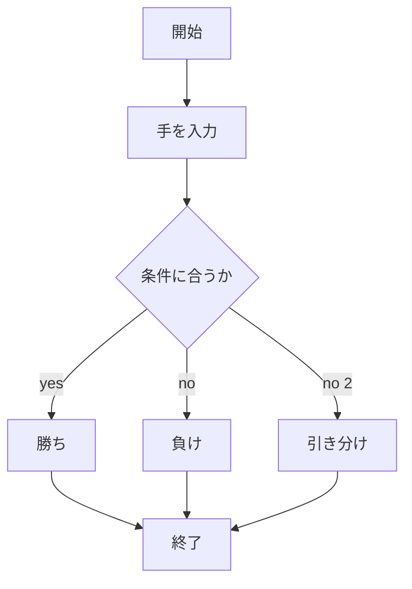
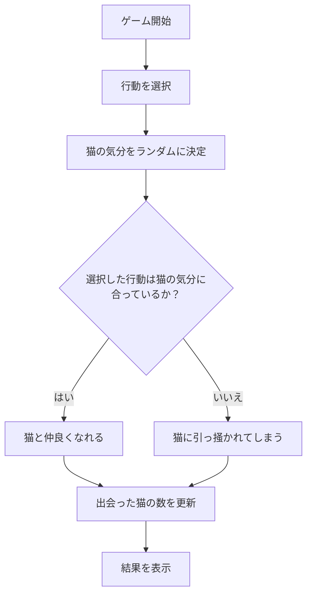
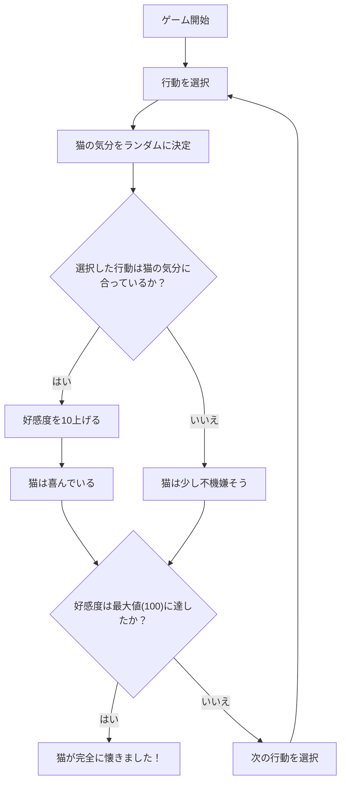

# webpro_06
## このプログラムについて
じゃんけんを行う，猫と仲良くなるゲーム，猫の好感度を上げるゲームの3つのプログラムを含む
## ファイル一覧

ファイル名 | 説明
-|-
app5.js | プログラム本体
public/janken.html | じゃんけんの開始画面
janken.ejs | じゃんけんのテンプレートファイル
public/cat.html | 猫と仲良くなるゲームの開始画面
cat.ejs | 猫と仲良くなるゲームののテンプレートファイル
public/catGame.html | 猫の好感度を上げるゲームの開始画面
catGame.ejs | 猫の好感度を上げるゲームののテンプレートファイル

## サーバーの立ち上げ方
1. ターミナルを起動する
1. 立ち上げたいサーバーのデータがあるディレクトリに```cd```コマンドで移動する
1. ```node ファイル名.js```と入力する

##　編集内容をGitで管理する方法
1. Githubのアカウントを作成し，アクセストークンを作成，保存する
1. ユーザー名とメールアドレスを登録する（1回実行するだけで良い）
```
$ git config --global user.name "ユーザー名"
$ git config --global user.email "メールアドレス"
```
これらに自身のユーザー名とメールアドレスを入力して一つずつ実行する
1. 保存したい内容があるディレクトリに```cd```コマンドで移動する
1. 次のコードを一つずつ実行する．なお2番目のコメントは編集内容の説明を入力する箇所である
```
$ git add .
$ git commit -am 'コメント'
$ git push
```
5. ここでGithubのアクセストークンを入力する


```javascript
console.log('Hello');
```
## じゃんけんゲームの機能

じゃんけんでランダムに決められた手と入力された手の勝ち負けを表示させる



### 使用方法
1. ```node app5.js``` でプログラムを起動する
1. Webブラウザでlocalhost:8080/public/janken.htmlにアクセスする
1. 自分が出したい手を入力


## 猫と仲良くなるゲームの機能

ランダムに決められる猫の気分に合った行動を選択すると猫と仲良くなることができる

猫の気分は「撫でてほしい」「お腹が空いた」「遊んでほしい」のいずれかである

選べる行動は「撫でる」「ご飯をあげる」「遊ぶ」のいずれかである

出会った回数（ゲームをした回数）と仲良くなった猫の数を表示させる



### 使用方法
1. ```node app5.js``` でプログラムを起動する
1. Webブラウザでlocalhost:8080/public/cat.htmlにアクセスする
1. 行動を選択し，送信ボタンを押す


## 猫の好感度を上げるゲームの機能

ランダムに決められる猫の気分に合った行動を選択すると猫の好感度が上がる

一度気分に合った行動をするたびに好感度が10上がり，最大値の100を目指す



### 使用方法
1. ```node app5.js``` でプログラムを起動する
1. Webブラウザでlocalhost:8080/public/catGame.htmlにアクセスする
1. 行動を選択し，送信ボタンを押す


2024/10/29
