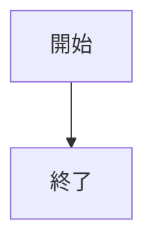
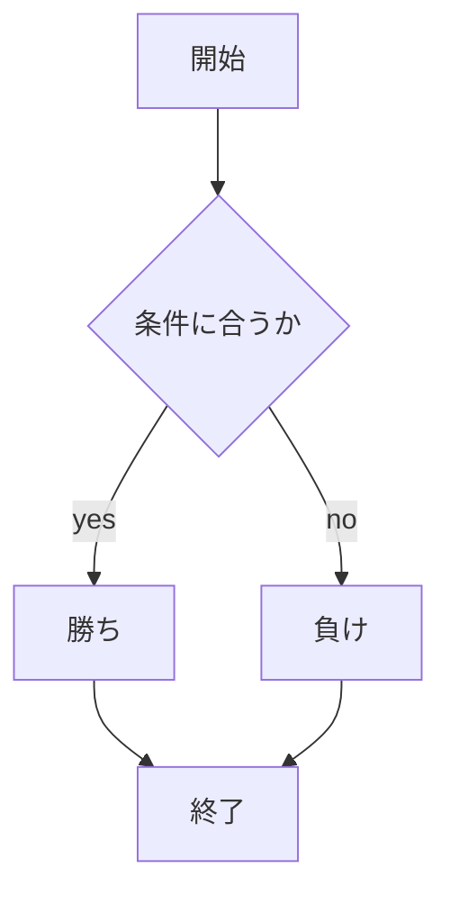

# webpro_06
## このプログラムについて

## ファイル一覧

ファイル名 | 説明
-|-
app5.js | プログラム本体
public/janken.html | じゃんけんの開始画面
janken.ejs | じゃんけんのテンプレートファイル
public/cat.html | 猫と仲良くなるゲームの開始画面
cat.ejs | 猫と仲良くなるゲームののテンプレートファイル

```javascript
console.log('Hello');
```

## 使用方法
1. ```node app5.js``` でプログラムを起動する
1. Webブラウザでlocalhost:8080/public/janken.htmlにアクセスする
1. 自分の手を入力する




2024/10/29
